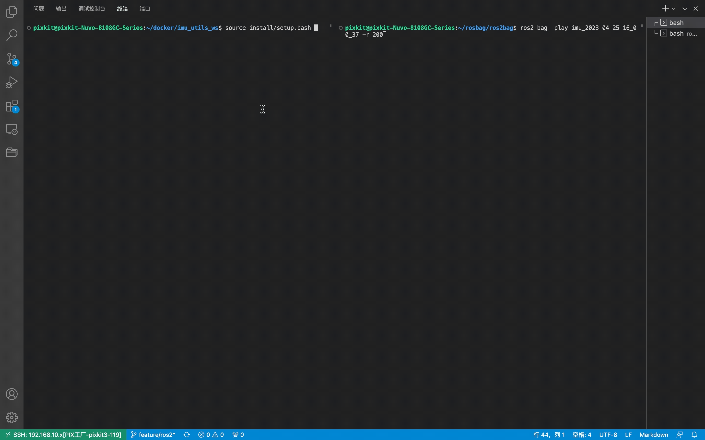

##  dependent
```shell
sudo apt-get install libdw-dev
```
## How to compile
```shell
colcon build --symlink-install --cmake-args -DCMAKE_BUILD_TYPE=Release 
```
## HOW TO USE
### 录制IMU`sensor_msgs/msg/Imu`ros2bag
- 车辆在水平地面静止
- 录制2.5h
- imu数据频率至少`100hz`

```shell
ros2 bag record -o [ros2bag_save_path] [imu_topic_name]
```
- 检查ros2bag
```shell
ros2 bag info [ros2bag_save_path]  
# example:  共146min
$ ros2 bag info imu_2023-04-25-16_00_37

Files:             imu_2023-04-25-16_00_37_0.db3
Bag size:          329.7 MiB
Storage id:        sqlite3
Duration:          8802.282s
Start:             Apr 25 2023 16:00:37.996 (1682409637.996)
End:               Apr 25 2023 18:27:20.278 (1682418440.278)
Messages:          880205
Topic information: Topic: /chc/imu | Type: sensor_msgs/msg/Imu | Count: 880205 | Serialization Format: cdr
```

### 开始标定
- 运行程序
```shell
ros2 launch ros2_imu_utils cgi_imu.launch.py data_save_path:=[cali_data_save_path]
example:
ros2 launch ros2_imu_utils cgi_imu.launch.py data_save_path:=/home/pixkit/docker/imu_utils_ws/data/
```
- 回放数据

> 200倍速回放，请检查没有其他的imu数据发布

```shell
ros2 bag  play [ros2bag_save_path] -r 200
ros2 bag  play imu_2023-04-25-16_00_37 -r 200
```


## 引用
[gaowenliang/imu_utils](https://github.com/gaowenliang/imu_utils)